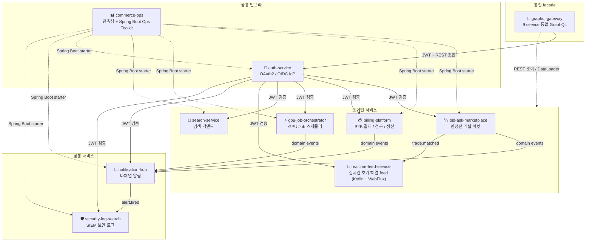

## GitHub Repository 구성

10 레포가 **하나의 시스템처럼 동작**하도록 설계했습니다 (`auth-service` IdP / `commerce-ops` 운영 starter / `notification-hub` 알림 fan-out / `security-log-search` SIEM / `graphql-gateway` 통합 facade 가 공통 인프라 역할).



---

## 레포 한눈에

| 레포 | 한 줄 | 핵심 기술 / 패턴 |
|------|-------|-----------------|
| [**auth-service**](https://github.com/ssa1004/auth-service) | OAuth2 / OIDC IdP | Spring Authorization Server 1.4, JWK rotation, refresh reuse detection + grace, OPA Rego (ABAC), RFC 7662/7009 |
| [**security-log-search**](https://github.com/ssa1004/security-log-search) | SIEM 보안 로그 수집 / 검색 / 알람 | ECS / OCSF + Sigma rules, OpenSearch + ClickHouse 듀얼 sink, Kafka + Flink, 멀티테넌트 4-layer 격리, ISMS-P |
| [**notification-hub**](https://github.com/ssa1004/notification-hub) | 다채널 알림 백엔드 | PUSH / EMAIL / SMS / KAKAO, Outbox + SKIP LOCKED, Resilience4j retry+CB, HMAC webhook, multi-channel rate limit, Virtual Threads |
| [**search-service**](https://github.com/ssa1004/search-service) | 검색 백엔드 | OpenSearch 기반 hexagonal, Saved Search alert, synonym dictionary hot reload, cursor pagination, 다국어 analyzer |
| [**billing-platform**](https://github.com/ssa1004/billing-platform) | B2B SaaS 결제 / 청구 / 정산 | Wallet/PG 결제 + Metering/Pricing/Invoice/Settlement, advisory lock + Outbox + DLQ, Spring Batch |
| [**bid-ask-marketplace**](https://github.com/ssa1004/bid-ask-marketplace) | 한정판 리셀 마켓 | Bid/Ask 매칭 엔진 (advisory lock + SKIP LOCKED), 거래 라이프사이클 Saga + 보상, Spring Modulith, Outbox + Kafka |
| [**gpu-job-orchestrator**](https://github.com/ssa1004/gpu-job-orchestrator) | GPU Job 스케줄러 (백엔드 + DevOps 풀스택) | Spring Boot, K8s, Outbox + Saga, Terraform, ArgoCD, Prometheus SLO + runbook |
| [**realtime-feed-service**](https://github.com/ssa1004/realtime-feed-service) | 실시간 호가/체결 feed 스트리밍 (bid-ask-marketplace 짝) | Kotlin, Spring WebFlux, Coroutines (Flow / structured concurrency), Project Reactor, R2DBC, Reactor Kafka, WebSocket / SSE, backpressure |
| [**commerce-ops**](https://github.com/ssa1004/commerce-ops) | E-commerce 마이크로서비스 + 관측성 | OpenTelemetry / Prometheus / Grafana / Loki / Tempo, 자체 Spring Boot Ops Toolkit (slow query / JFR / correlation MDC starter) |
| [**graphql-gateway**](https://github.com/ssa1004/graphql-gateway) | 9 service 통합 GraphQL gateway | Spring for GraphQL, DataLoader N+1 batching, JWT + token relay, Resilience4j (downstream CB/retry), Relay cursor connection, query complexity 제한 |

---

## API 문서

각 REST 서비스는 빌드 시 `springdoc-openapi-gradle-plugin` 으로 OpenAPI 3 spec 을 export 하고, 그 spec 들을 [`docs/api/`](./docs/api/) 에 한곳으로 모았습니다. [`docs/api/README.md`](./docs/api/README.md) 에 9 서비스 spec 의 raw 링크 표와 Redoc / Swagger UI 로 보는 법이 있고, [`docs/api/index.html`](./docs/api/index.html) 은 드롭다운으로 여러 spec 을 한 화면에서 탐색하는 Redoc 통합 뷰어입니다. 모인 spec 은 클라이언트 SDK codegen 의 입력으로도 쓸 수 있습니다.

---

## 공통 운영 패턴

같은 패턴이 10 레포에 반복 적용되어 있습니다. 한 레포에서 본 패턴을 다른 레포에서 그대로 찾을 수 있습니다.

- **HikariCP** 풀 사이즈 산정 + leak detection (운영 누수 추적용 stack trace)
- **K8s 3종 probe** (startup / readiness / liveness) 분리, readiness 는 외부 의존 (Kafka/Redis) 까지 체크
- **Graceful shutdown** — `server.shutdown=graceful` + `timeout-per-shutdown-phase` + K8s `terminationGracePeriodSeconds` + `preStop sleep`
- **Resilience4j** retry + circuit breaker + bulkhead (exponential backoff + ±50% jitter)
- **Outbox + SKIP LOCKED** — 다중 인스턴스 안전, at-least-once 보장, 행 단위 트랜잭션
- **Saga 보상** — `REQUIRES_NEW` 격리, compensation log fingerprint 멱등
- **Idempotency-Key** 응답 캐싱 (24h), body fingerprint 검증
- **Cursor pagination** — Snowflake ID, sort key 결정성
- **Cache stampede 방어** — XFetch + SETNX
- **MDC 기반 correlation** — traceId / spanId 자동 전파 (correlation-mdc-starter)

---

## 기술 스택

**Language**: Java 21 (virtual threads), Kotlin 2.x (Coroutines / Flow)
**Framework**: Spring Boot 3.x (Modulith / WebFlux / Authorization Server 1.4), Hexagonal Architecture, Project Reactor
**Data**: PostgreSQL (Flyway), Redis, OpenSearch / Elasticsearch, ClickHouse
**Streaming**: Apache Kafka, Apache Flink 1.18
**Auth**: OAuth2 / OIDC (Authorization Server), JWT, OPA Rego (ABAC)
**Observability**: OpenTelemetry, Prometheus, Grafana, Loki, Tempo, Micrometer
**Infra**: Kubernetes (Kustomize), Helm, ArgoCD, Terraform, GitHub Actions

---

## Deployment

10 service 의 Helm chart 를 ArgoCD ApplicationSet 한 묶음으로 동시 배포합니다 ([`ops/argocd/`](./ops/argocd/)).

- `ops/argocd/projects.yaml` — AppProject `ssa1004-portfolio` (10 sourceRepos 화이트리스트)
- `ops/argocd/applicationset.yaml` — 10 service 동시 배포 ApplicationSet (single env)
- `ops/argocd/applicationset-{dev,prod}.yaml` — env 별 분리 (namespace `<name>-{env}` + `values-{env}.yaml`)

```bash
kubectl apply -f ops/argocd/projects.yaml
kubectl apply -f ops/argocd/applicationset.yaml
```
